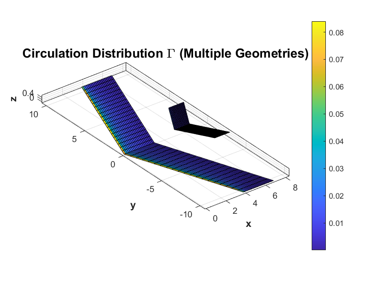

# 3D-CFD-with-Weissinger-method
[](https://matlab.mathworks.com/open/github/v1?repo=lucapiombo/3D-CFD-with-Weissinger-method)

This project aims to perform an analysis of a three-dimensional aerodynamic problem by examining a finite wing through the numerical implementation of *Weissinger’s method*.

The code allows to extract most relevant aerodynamics data. The geometry that includes the effect of a tail with and without ground effects, change of sweep angle and other geometric features. The methodology has been implemented in MATLAB, and its validation has been carried out using XFLR5.

An example of the code is reported below:


> **Note:**  
> This code was developed for personal learning and demonstration purposes. It has not been fully optimized and should be treated as a reference for panel method implementations.

## 📂 Project Structure

The repository is organized as follows:

- **Main Scripts**
  - `main.m`: Single wing test case.
  - `main_tandem.m`: Tandem configuration (wing and tail).
  - `main_ground.m`: Tandem configuration with ground effect.
- **`functions/`**: Reusable MATLAB functions.
- **`results/`** (optional): Generated output files and plots (if saved).

## 🚀 Getting Started

1. Clone this repository.
   ```bash
   git clone https://github.com/lucapiombo/3D-CFD-with-Weissinger-method.git
2. Open MATLAB and navigate to the project directory.
3. Run the appropriate main script to generate and view the results for your desired configuration.
---

## 🤝 Contributing
Feel free to fork this repository and modify or extend the code for your own research or learning.
If you find issues or have suggestions for improvement, please open an issue or submit a pull request.

## 📄 Licence
This project is licensed under the **MIT License**.  
See the [LICENSE](LICENSE.txt) file for details.
